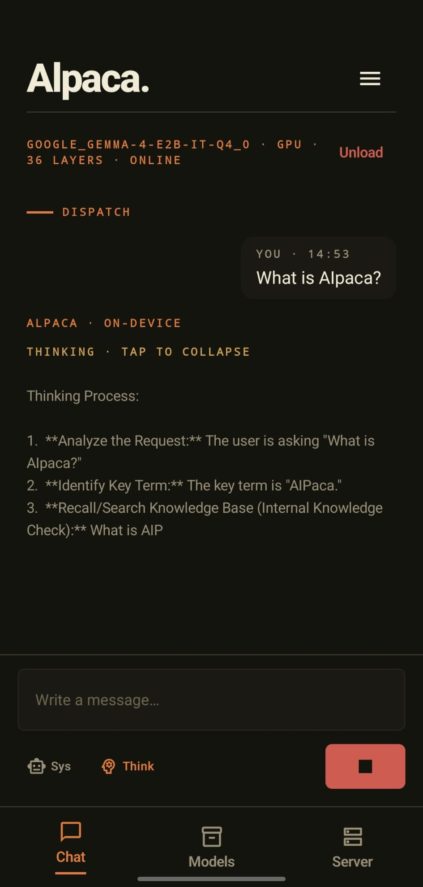
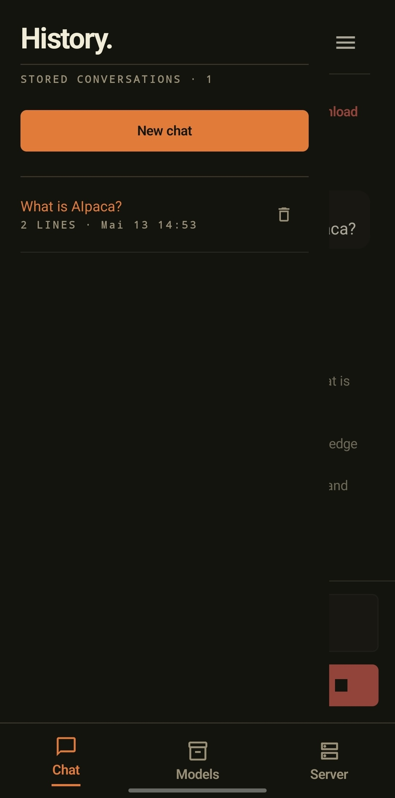
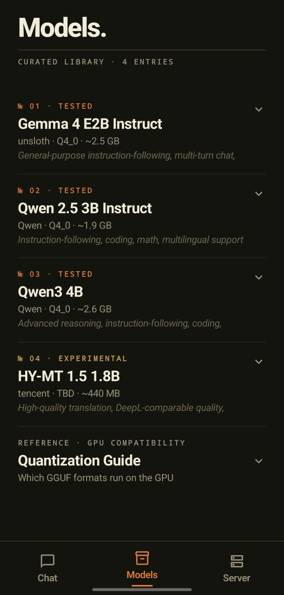
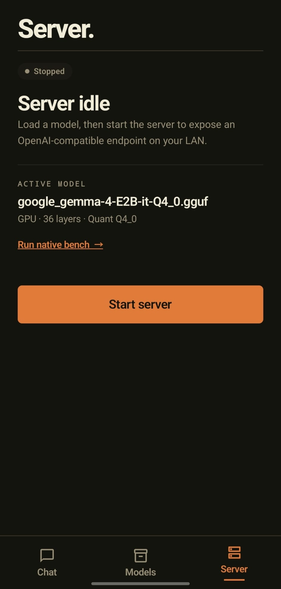

# AIpaca

[](LICENSE)
[](https://developer.android.com/about/versions/pie)
[](#openai-compatible-rest-api)

**On-device AI for Android — LLM, vision, speech, and agent capabilities, all running locally on your phone.**

AIpaca runs GGUF models entirely on-device via llama.cpp with GPU acceleration. It provides a built-in chat UI, speech-to-text, multimodal vision, an on-device agent with tool calling, and an OpenAI-compatible REST API server — all without any cloud dependency.

---

## Screenshots

| Chat | Chat History | Models | Server |
|:---:|:---:|:---:|:---:|
|  |  |  |  |

---

## Features

### On-Device LLM Chat
- Run any GGUF model locally via llama.cpp — no cloud, no subscription
- GPU-accelerated inference on Qualcomm Adreno (OpenCL)
- Streaming token output with real-time display
- Encrypted conversation history with multiple saved chats
- Reasoning/thinking token support (DeepSeek-style models)

### Vision / Multimodal
- Image + text prompts via llama.cpp's mtmd library
- Auto-detection of multimodal capability from GGUF metadata
- Separate mmproj (multimodal projector) file support
- PDF text extraction for document-based queries
- Attach images and documents directly in chat

### Speech-to-Text
- On-device transcription via whisper.cpp (v1.8.4)
- GPU-accelerated (OpenCL, standard attention path)
- Real-time microphone input with automatic transcription

### Agent Mode
- Native on-device agent loop: think → tool call → observe → repeat
- Structured tool calling via llama.cpp Jinja templates + PEG parser
- MCP (Model Context Protocol) client over Streamable HTTP
- Tavily web search integration as first tool
- Tool registry aggregating tools from multiple MCP servers
- Streaming agent steps in the UI (thinking, tool calls, observations)
- Graceful handling of hallucinated/failed tool calls

### OpenAI-Compatible REST API
- HTTPS server on port 8443 with self-signed TLS certificates
- Full `/v1/chat/completions` compatibility (streaming + non-streaming)
- Works with Open WebUI, OpenClaw, LangChain, any OpenAI SDK, or `curl`
- Ed25519 asymmetric key authentication (SSH-style)
- QR code + PIN device pairing
- Android foreground service keeps server alive in background

For detailed API usage with Python, curl, Android, iOS, and OpenAI SDK examples, see [docs/api-client-guide.md](docs/api-client-guide.md).

For a full breakdown of all capabilities, see [docs/capabilities.md](docs/capabilities.md).

---

## Quick Start

### 1. Prerequisites

| Tool | Version |
|---|---|
| Android Studio | Hedgehog 2023.1+ |
| Android NDK | r27.2.12479018 |
| CMake | 3.22+ |
| Device | API 28+, arm64, 4+ GB RAM (Snapdragon recommended for GPU) |

Install NDK and CMake via **Android Studio → SDK Manager → SDK Tools**.

### 2. Clone and initialise

```bash
git clone https://github.com/janik96v/AIpaca.git
cd AIpaca
git submodule update --init --recursive   # pulls llama.cpp + whisper.cpp
```

### 3. Download a model

Download a GGUF file and copy it to your phone (USB, cloud storage, or adb push).
The in-app **Models tab** links directly to each model's Hugging Face page.

| Model | Size | Quant | GPU | Vision | Tool-Calling |
|---|---|---|---|---|---|
| Gemma 4 E2B Instruct (unsloth) | ~2.5 GB | Q4_0 | Yes | Yes | Yes |
| **Qwen 2.5 3B Instruct** (recommended) | ~1.9 GB | Q4_0 | Yes | No | Yes |
| Qwen3 4B | ~2.6 GB | Q4_0 | Yes | Yes | Yes |
| HY-MT 1.5 1.8B (translation) | ~440 MB | Q4_0 | TBD | No | TBD |

> **GPU compatibility:** AIpaca uses the Adreno OpenCL backend with optimized kernels. GPU-accelerated quantizations: Q4_0, Q4_1, Q4_K_S, Q4_K_M, Q5_K_S, Q5_K_M, Q6_K, Q8_0, IQ4_NL. All others fall back to CPU automatically.

### 4. Build and run

```
Android Studio → Run → Select your device
```

Or via CLI:

```bash
./gradlew installDebug
```

### 5. Load model in app

**Chat tab** → tap **"Load model from storage"** → pick the `.gguf` file.
The model loads in the background (~5-15 seconds depending on size and GPU offload).

### 6. (Optional) Start the API server

**Server tab** → tap **"START_SERVER"**

The notification shows: `AIpaca Server • https://192.168.x.x:8443`

### 7. (Optional) Pair a client device

**Server tab** → tap **"PAIR_NEW_DEVICE"** → scan the QR code or enter the 6-digit PIN.

```bash
# Health check — no auth needed
curl -k https://192.168.1.XX:8443/health

# Chat — requires signed Authorization header (see docs/api-client-guide.md)
curl -k -X POST https://192.168.1.XX:8443/v1/chat/completions \
  -H "Authorization: AIpaca-Ed25519 <pubkey> <sig> <timestamp>" \
  -H "Content-Type: application/json" \
  -d '{"model":"local","messages":[{"role":"user","content":"Hello!"}],"stream":false}'
```

---

## Architecture

```
UI (Jetpack Compose + Material 3)
    |  StateFlow
EngineState (process-scoped singleton)
    |-- LlamaCppEngine --> llama_jni.cpp --> llama.cpp (GPU/CPU)
    |-- WhisperEngine ---> whisper_jni.cpp --> whisper.cpp (GPU/CPU)
    +-- AgentOrchestrator --> MCP tools (Streamable HTTP)

--- parallel ---

Ktor HTTPS Server (port 8443, TLS + Ed25519 auth)
    |  calls same EngineState (serialized via generateMutex)
OpenAI-compatible REST API --> Open WebUI / curl / any OpenAI SDK
```

For project structure, tech stack, GPU details, and build configuration, see [docs/architecture.md](docs/architecture.md).

---

## API Reference

| Endpoint | Auth | Description |
|---|---|---|
| `GET /health` | None | Health check + model status |
| `POST /v1/pair` | PIN | Register client Ed25519 public key |
| `GET /v1/models` | Ed25519 | List loaded models |
| `POST /v1/chat/completions` | Ed25519 | Chat inference (streaming/non-streaming) |

Standard OpenAI `/v1/chat/completions` format with `messages`, `stream`, `temperature`, `max_tokens`, etc. Set `"stream": true` for SSE token streaming.

For full request/response examples, authentication details, and client code (Python, curl, Android, iOS, OpenAI SDK), see [docs/api-client-guide.md](docs/api-client-guide.md).

---

## Roadmap

### Implemented

- [x] On-device LLM chat via llama.cpp
- [x] GPU acceleration (Adreno OpenCL with optimized kernels)
- [x] Streaming token output
- [x] Encrypted conversation history
- [x] Multimodal / vision support (llama.cpp mtmd)
- [x] Speech-to-text (whisper.cpp)
- [x] OpenAI-compatible REST API server
- [x] TLS / HTTPS transport encryption
- [x] Ed25519 asymmetric key authentication
- [x] QR code + PIN device pairing
- [x] Android foreground service for background operation
- [x] Agent mode with think→tool→observe loop
- [x] Native tool-calling (Jinja template + PEG parser)
- [x] MCP client (Streamable HTTP/SSE)
- [x] Tavily web search tool integration
- [x] Reasoning/thinking token support
- [x] PDF text extraction

### In Progress

- [ ] Agent tool-calling refinements and streaming improvements (PR1 Increment 3-5)
- [ ] Agent-specific UI enhancements

### Planned

- [ ] KV-cache prefix reuse across agent turns (PR2 Phase 1 — in-session)
- [ ] Persistent KV-cache for system prompt (PR2 Phase 2)
- [ ] In-app HuggingFace model browser
- [ ] Multi-request queuing for API server
- [ ] Programmatic tool calling (in-process JS sandbox)
- [ ] File-based skill system with progressive disclosure
- [ ] FTS5-based cross-session recall
- [ ] iOS port (shared llama.cpp core + SwiftUI)

For detailed roadmap with technical specs, see [docs/roadmap.md](docs/roadmap.md).

---

## Documentation

| Document | Description |
|---|---|
| [docs/capabilities.md](docs/capabilities.md) | Detailed breakdown of all app capabilities |
| [docs/architecture.md](docs/architecture.md) | Architecture, tech stack, GPU details, project structure |
| [docs/api-client-guide.md](docs/api-client-guide.md) | REST API guide with code examples (Python, curl, OpenAI SDK) |
| [docs/roadmap.md](docs/roadmap.md) | Implementation status and plans |

---

## Why AIpaca?

PocketPal, SmolChat, Off Grid — all great apps, but none expose a local API.
Termux + llama-server works but it's a developer hack, not a product.

AIpaca is the first **polished Android app** that turns your phone into a portable AI server — usable as an Ollama replacement for Open WebUI and anything that speaks the OpenAI API. Plus it adds on-device agent capabilities, vision, and speech-to-text that work completely offline.

---

## Contributing

Contributions are welcome! Please read [CONTRIBUTING.md](CONTRIBUTING.md) before opening a PR.

Bug reports and feature requests go in [GitHub Issues](https://github.com/janik96v/AIpaca/issues) — use the provided templates.

By contributing you agree that your code will be licensed under the [Apache 2.0 License](LICENSE).

---

## License

```
Copyright 2025 Janik Vollenweider

Licensed under the Apache License, Version 2.0 (the "License");
you may not use this file except in compliance with the License.
You may obtain a copy of the License at

    http://www.apache.org/licenses/LICENSE-2.0
```
